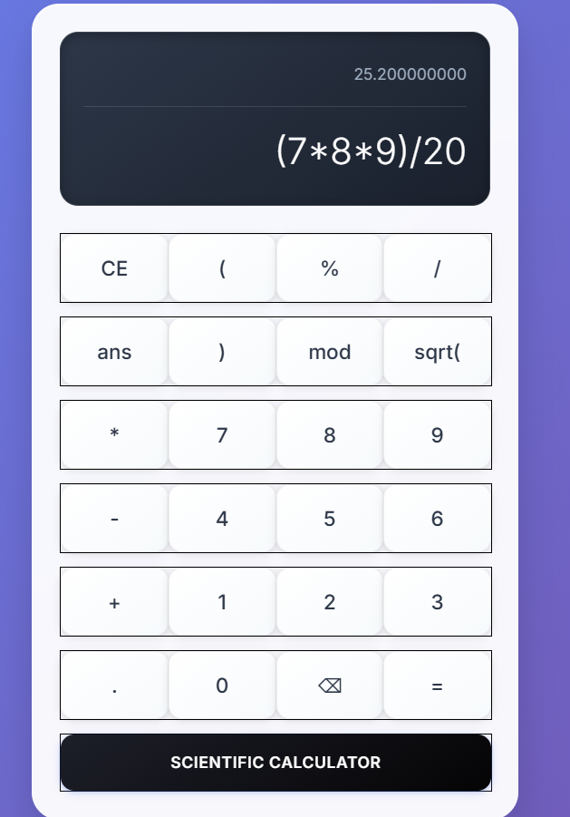
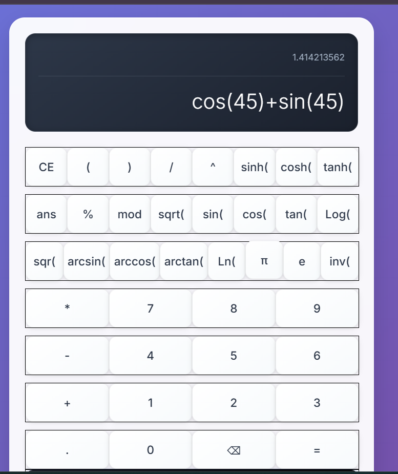

# 🧮 Calculator

A simple web-based calculator built using **HTML**, **CSS**, and **JavaScript**.  
It performs basic arithmetic operations like addition, subtraction, multiplication, and division — all in a clean, responsive interface.

## 🚀 Features
- Perform basic mathematical operations   
- Built entirely with vanilla HTML, CSS, and JS  
- Real-time result updates  

You can view the live version here (optional):  
👉 https://calculatorn2k.onrender.com/  

  
Main interface of the calculator:  

Scientific interface of the calculator:  

